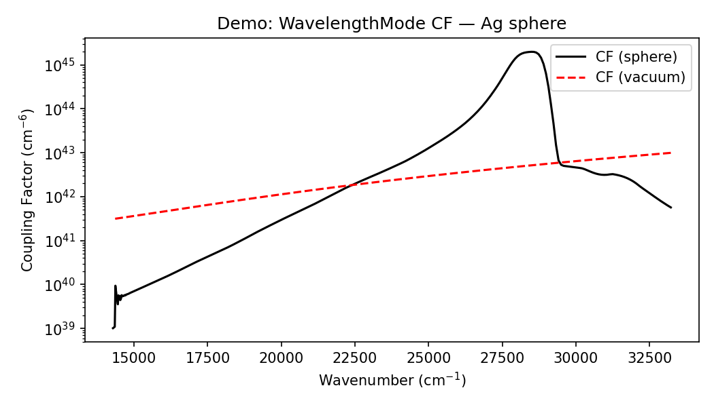

# MieDipole (Python)

Python implementation of **Generalized Mie Theory** for a spherical scatterer illuminated by an electric dipole source.

Ported from the MATLAB codebase on the [`main`](https://github.com/yu2C/MieDipole/tree/main) branch (`yu-py` branch).

**Reference:** Lee & Hsu, *J. Phys. Chem. Lett.* **2020**, *11*, 6796–6804. [DOI](https://pubs.acs.org/doi/10.1021/acs.jpclett.0c01989)

## Quick Start

```bash
git clone -b yu-py https://github.com/yu2C/MieDipole.git
cd MieDipole
uv sync
uv run python main.py
```

## Project Structure

```
├── main.py              Entry point
├── Functions/           Core Python modules
├── InputFiles/          JSON / CSV inputs
├── benchmark/           Reference data & regression baselines
├── tests/               pytest suite
├── docs/                Example figures
└── archive/             Development history
```



## Tests

```bash
uv run pytest tests/ -v
```

## Branches

| Branch | Language |
|--------|----------|
| `main` | MATLAB (original) |
| `yu-py` | Python (this branch) |

## Citation

```bibtex
@article{Lee2020,
    author  = {Lee, Ming-Wei and Hsu, Liang-Yan},
    journal = {J. Phys. Chem. Lett.},
    volume  = {11}, number = {16}, pages = {6796--6804}, year = {2020},
    doi     = {10.1021/acs.jpclett.0c01989}
}
```
